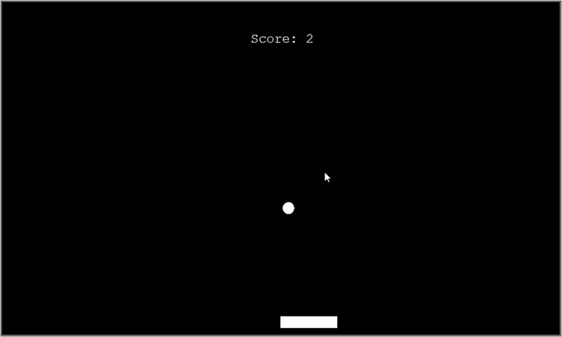

# Pong for lonely people
Because clearly, what the world needed most was a single-player pong game you control with your hand.  
**Groundbreaking. Life-changing. Utterly pointless**.
#### Demo :
  

### Libraries used:  
**Mediapipe** for handtracking and landmarking  
**Threading** for running hand detection in background  
**Turtle** for GUI  
**open-cv python** for computer vision
